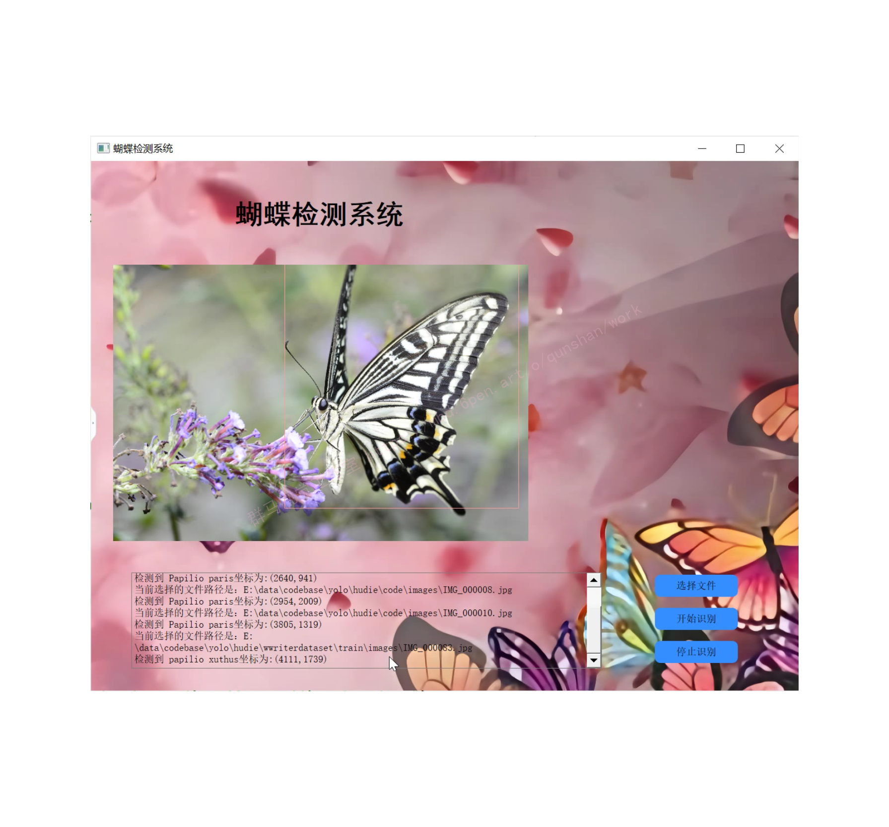
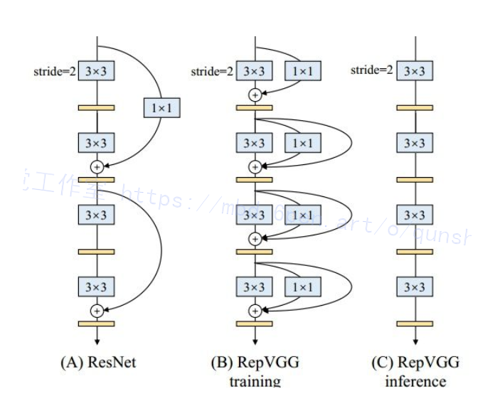

# 1.研究背景
蝴蝶种类的识别与鉴定在农林业生产与保护、艺术生活等方面均具有重要意义．蝴蝶种类极其丰富多样，《世界蝴蝶分类名录》1]记录了世界蝴蝶17科、47亚科、1690属、15141种,其中记载中国蝴蝶12科、33亚科、434属、2153种．自2016年我国环境保护部启动了蝴蝶多样性观测工作2，全国蝴蝶观测数据库的数据量呈现海量增长．如何对生态蝴蝶及时且准确地检测,这对昆虫分类学专家是一个很大的挑战.因此，自然生态蝴蝶种类检测问题已成为促进蝴蝶相关领域研究与应用的关键问题之一。

# 2.图片演示




# 3.视频演示
[基于改进YOLOv7的蝴蝶识别系统（源码＆教程）_哔哩哔哩_bilibili](https://www.bilibili.com/video/BV1BW4y1e7Vq/?vd_source=bc9aec86d164b67a7004b996143742dc)


# 4.YOLOv7算法简介
##  YOLOv7 在 5 FPS 到 160 FPS 范围内，速度和精度都超过了所有已知的目标检测器 
并在 V100 上，30 FPS 的情况下达到实时目标检测器的最高精度 56.8% AP。YOLOv7 是在 MS COCO 数据集上从头开始训练的，不使用任何其他数据集或预训练权重。
相对于其他类型的工具，YOLOv7-E6 目标检测器（56 FPS V100，55.9% AP）比基于 transformer 的检测器 SWINL Cascade-Mask R-CNN（9.2 FPS A100，53.9% AP）速度上高出 509%，精度高出 2%，比基于卷积的检测器 ConvNeXt-XL Cascade-Mask R-CNN (8.6 FPS A100, 55.2% AP) 速度高出 551%，精度高出 0.7%。


此外， YOLOv7 的在速度和精度上的表现也优于 YOLOR、YOLOX、Scaled-YOLOv4、YOLOv5、DETR 等多种目标检测器。

# 5.加入RepVGG模型结构
#### 模型定义
[该博客提出的的“VGG式”](https://afdian.net/item?plan_id=291a859259b611edb4f052540025c377)指的是：

没有任何分支结构。即通常所说的plain或feed-forward架构。

仅使用3x3卷积。

仅使用ReLU作为激活函数。

下面用一句话介绍RepVGG模型🚀的基本架构：将20多层3x3卷积堆起来，分成5个stage，每个stage的第一层是stride=2的降采样，每个卷积层用ReLU作为激活函数。

[改进后的RepVGG模型](https://mbd.pub/o/bread/mbd-Y5mUlZpp)的详细结构：RepVGG-A的5个stage分别有[1, 2, 4, 14, 1]层，RepVGG-B的5个stage分别有[1, 4, 6, 16, 1]层，宽度是[64, 128, 256, 512]的若干倍。这里的倍数是随意指定的诸如1.5,2.5这样的“工整”的数字，没有经过细调。

再用一句话介绍训练设定：ImageNet上120 epochs，不用trick，甚至直接用PyTorch官方示例的训练代码就能训出来


# 6.改进后的网络特点
（1）3x3卷积非常快。在GPU上，3x3卷积的计算密度（理论运算量除以所用时间）可达1x1和5x5卷积的四倍。

（2）单路架构非常快，因为并行度高。同样的计算量，“大而整”的运算效率远超“小而碎”的运算。

（3）单路架构省内存。例如，ResNet的shortcut虽然不占计算量，却增加了一倍的显存占用。

（4）单路架构灵活性更好，容易改变各层的宽度（如剪枝）。

（5）RepVGG主体部分只有一种算子：3x3卷积接ReLU。在设计专用芯片时，给定芯片尺寸或造价，我们可以集成海量的3x3卷积-ReLU计算单元来达到很高的效率。别忘了，单路架构省内存的特性也可以帮我们少做存储单元。


# 7.代码实现
#### 配置文件
```

# YOLOv7 🚀, GPL-3.0 license
# parameters
nc: 80  # number of classes
depth_multiple: 0.33  # model depth multiple
width_multiple: 1.0  # layer channel multiple

# anchors
anchors:
  - [12,16, 19,36, 40,28]  # P3/8
  - [36,75, 76,55, 72,146]  # P4/16
  - [142,110, 192,243, 459,401]  # P5/32

# yolov7 backbone by yoloair
backbone:
  # [from, number, module, args]
  [[-1, 1, Conv, [32, 3, 1]],  # 0
   [-1, 1, Conv, [64, 3, 2]],  # 1-P1/2
   [-1, 1, Conv, [64, 3, 1]],
   [-1, 1, Conv, [128, 3, 2]],  # 3-P2/4 
   [-1, 1, RepVGGBlock, [128, 3, 2]], # 5-P4/16
   [-1, 1, Conv, [256, 3, 2]], 
   [-1, 1, MP, []],
   [-1, 1, Conv, [128, 1, 1]],
   [-3, 1, Conv, [128, 1, 1]],
   [-1, 1, Conv, [128, 3, 2]],
   [[-1, -3], 1, Concat, [1]],  # 16-P3/8
   [-1, 1, Conv, [128, 1, 1]],
   [-2, 1, Conv, [128, 1, 1]],
   [-1, 1, Conv, [128, 3, 1]],
   [-1, 1, Conv, [128, 3, 1]],
   [-1, 1, Conv, [128, 3, 1]],
   [-1, 1, Conv, [128, 3, 1]],
   [[-1, -3, -5, -6], 1, Concat, [1]],
   [-1, 1, Conv, [512, 1, 1]],
   [-1, 1, MP, []],
   [-1, 1, Conv, [256, 1, 1]],
   [-3, 1, Conv, [256, 1, 1]],
   [-1, 1, Conv, [256, 3, 2]],
   [[-1, -3], 1, Concat, [1]],
   [-1, 1, Conv, [256, 1, 1]],
   [-2, 1, Conv, [256, 1, 1]],
   [-1, 1, Conv, [256, 3, 1]],
   [-1, 1, Conv, [256, 3, 1]],
   [-1, 1, Conv, [256, 3, 1]],
   [-1, 1, Conv, [256, 3, 1]],
   [[-1, -3, -5, -6], 1, Concat, [1]],
   [-1, 1, Conv, [1024, 1, 1]],          
   [-1, 1, MP, []],
   [-1, 1, Conv, [512, 1, 1]],
   [-3, 1, Conv, [512, 1, 1]],
   [-1, 1, Conv, [512, 3, 2]],
   [[-1, -3], 1, Concat, [1]],
   [-1, 1, C3C2, [1024]],
   [-1, 1, Conv, [256, 3, 1]],
  ]

# yolov7 head by yoloair
head:
  [[-1, 1, SPPCSPC, [512]],
   [-1, 1, Conv, [256, 1, 1]],
   [-1, 1, nn.Upsample, [None, 2, 'nearest']],
   [31, 1, Conv, [256, 1, 1]],
   [[-1, -2], 1, Concat, [1]],
   [-1, 1, C3C2, [128]],
   [-1, 1, Conv, [128, 1, 1]],
   [-1, 1, nn.Upsample, [None, 2, 'nearest']],
   [18, 1, Conv, [128, 1, 1]],
   [[-1, -2], 1, Concat, [1]],
   [-1, 1, C3C2, [128]],
   [-1, 1, MP, []],
   [-1, 1, Conv, [128, 1, 1]],
   [-3, 1, Conv, [128, 1, 1]],
   [-1, 1, Conv, [128, 3, 2]],
   [[-1, -3, 44], 1, Concat, [1]],
   [-1, 1, C3C2, [256]], 
   [-1, 1, MP, []],
   [-1, 1, Conv, [256, 1, 1]],
   [-3, 1, Conv, [256, 1, 1]],
   [-1, 1, Conv, [256, 3, 2]], 
   [[-1, -3, 39], 1, Concat, [1]],
   [-1, 3, C3C2, [512]],

# 检测头 -----------------------------
   [49, 1, RepConv, [256, 3, 1]],
   [55, 1, RepConv, [512, 3, 1]],
   [61, 1, RepConv, [1024, 3, 1]],

   [[62,63,64], 1, IDetect, [nc, anchors]],   # Detect(P3, P4, P5)
  ]

```

# 8.系统整合
[下图源码＆环境部署视频教程＆改进后的网络结构＆自定义UI界面](https://s.xiaocichang.com/s/a312ba)

参考[博客《基于改进YOLOv7的蝴蝶识别系统（源码＆教程）》](https://mbd.pub/o/qunma/work)

# 9.参考文献
[1]谢娟英,侯琦,史颖欢,等.蝴蝶种类自动识别研究[D].2018
[2]李策,张亚超,蓝天,等.一种高分辨率遥感图像视感知目标检测算法[D].2018
[3]马方舟,徐海根,陈萌萌,等.全国蝴蝶多样性观测网络（China BON-Butterflies）建设进展[D].2018
[4]刘丽,赵凌君,郭承玉,等.图像纹理分类方法研究进展和展望[D].2018
[5]张慧,王坤峰,王飞跃.深度学习在目标视觉检测中的应用进展与展望[D].2017
[6]罗建豪,吴建鑫.基于深度卷积特征的细粒度图像分类研究综述[D].2017
[7]常亮,邓小明,周明全,等.图像理解中的卷积神经网络[D].2016
[8]孙晓,潘汀,任福继.基于ROI-KNN卷积神经网络的面部表情识别[D].2016
[9]周爱明,马鹏鹏,席天宇,等.基于深度学习的蝴蝶科级标本图像自动识别[D].2017
[10]李凡.基于数字图像的蝴蝶种类自动识别研究[D].2015

---
#### 如果您需要更详细的【源码和环境部署教程】，除了通过【系统整合】小节的链接获取之外，还可以通过邮箱以下途径获取:
#### 1.请先在GitHub上为该项目点赞（Star），编辑一封邮件，附上点赞的截图、项目的中文描述概述（About）以及您的用途需求，发送到我们的邮箱
#### sharecode@yeah.net
#### 2.我们收到邮件后会定期根据邮件的接收顺序将【完整源码和环境部署教程】发送到您的邮箱。
#### 【免责声明】本文来源于用户投稿，如果侵犯任何第三方的合法权益，可通过邮箱联系删除。